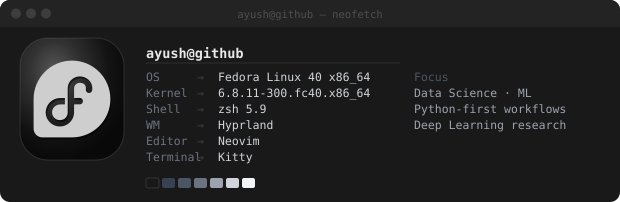

<div align="center">

```text
┌──────────────────────────────────────────────────────────────────────────┐
│                                                                          │
│                 █████╗ ██╗   ██╗██╗   ██╗███████╗██╗  ██╗                │
│                ██╔══██╗╚██╗ ██╔╝██║   ██║██╔════╝██║  ██║                │
│                ███████║ ╚████╔╝ ██║   ██║███████╗███████║                │
│                ██╔══██║  ╚██╔╝  ██║   ██║╚════██║██╔══██║                │
│                ██║  ██║   ██║   ╚██████╔╝███████║██║  ██║                │
│                ╚═╝  ╚═╝   ╚═╝    ╚═════╝ ╚══════╝╚═╝  ╚═╝                │
│                                                                          │
└──────────────────────────────────────────────────────────────────────────┘
```

<div align="left">
  
</div>

<br/>

<details>
<summary><code>$ ./ayush --explore</code> <kbd>Click to expand</kbd></summary>
<br/>

<div align="left">

```bash
$ whoami
```

</div>

<div align="center">
  
</div>

<div align="left">

```bash
$ cat about.txt
```

```text
┌─────────────────────────────────────────────────────────────────┐
│  role         →  ML Engineer & Data Science enthusiast          │
│  focus        →  Machine Learning · Deep Learning · CV · NLP    │
│  stack        →  Python · C++ · PyTorch · scikit-learn          │
│  status       →  Exploring ML frameworks deeply                  │
│  interests    →  Intelligent systems · AI research · Data archi  │
│  collab       →  Open to research-oriented, impactful projects   │
└─────────────────────────────────────────────────────────────────┘
```

```bash
$ ls -la skills/
```

</div>

<div align="center">
  
  
  
  
  
  
  
  
  
  
</div>

<div align="left">

```bash
$ neofetch
```

</div>

<div align="center">
  
</div>

<div align="left">

```bash
$ gh stats --user BhattAyush17
```

</div>

<div align="center">

<table width="100%" border="0" cellspacing="0" cellpadding="8">
  <tr>
    <td width="33%" align="center">
      
    </td>
    <td width="33%" align="center">
      
    </td>
    <td width="33%" align="center">
      
    </td>
  </tr>
</table>

<table width="100%" border="0" cellspacing="0" cellpadding="6">
  <tr>
    <td width="50%" align="center">
      
    </td>
    <td width="50%" align="center">
      
    </td>
  </tr>
  <tr>
    <td width="50%" align="center">
      
    </td>
    <td width="50%" align="center">
      
    </td>
  </tr>
</table>

</div>

<div align="left">

```bash
$ git log --graph --oneline --all   # contribution history
```

</div>

<div align="center">
  
</div>

<div align="left">

```bash
$ gh repo list --pinned BhattAyush17
```

</div>

<div align="center">

| `repo` | `description` | `lang` | `⭐` | `🍴` |
|--------|---------------|--------|------|------|
| [ProPhet_BnB](https://github.com/BhattAyush17/ProPhet_BnB) | Airbnb price prediction | Python |  |  |
| [Lane_Morph](https://github.com/BhattAyush17/Lane_Morph) | Lane detection & morphing | Python |  |  |
| [Greydge](https://github.com/BhattAyush17/Greydge) | Greyscale image analysis pipeline | Python |  |  |
| [zavix-animegan-app](https://github.com/BhattAyush17/zavix-animegan-app) | AnimeGAN web app | Python |  |  |
| [Loan-Dash-X](https://github.com/BhattAyush17/Loan-Dash-X) | Loan dashboard application | Python |  |  |
| [DSA](https://github.com/BhattAyush17/DSA) | Data structures & algorithms | C++ |  |  |

</div>

<div align="left">

```bash
$ gh achievement list --user BhattAyush17
```

</div>

<div align="center">


&nbsp;&nbsp;

&nbsp;&nbsp;


</div>

<div align="left">

```bash
$ cat quotes.txt
```

```text
"Currently exploring the intersection of 'this is interesting' and 'this is a terrible idea.'"
"Exploring the stack one questionable decision at a time."
"Building, breaking, learning ; occasionally in that order."
```

```bash
$ echo "thanks for visiting — open to collabs that matter."
```

```text
thanks for visiting — open to collabs that matter.
```

</div>
</details>

</div>
