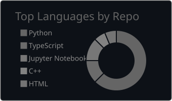
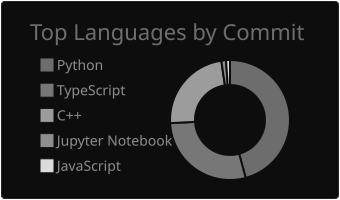
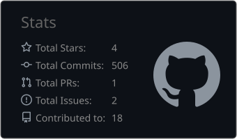
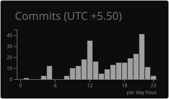
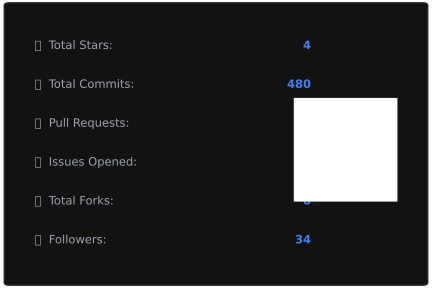
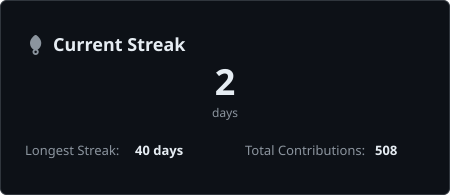
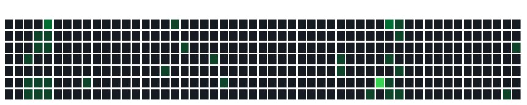

  

    

  

 

  <b>
    
      Transforming data into actionable insights to address real-world challenges.
    
  </b>

 

  

  <i>— peace</i>

---

# Intro

Following my curiosity into the world of Data Science and Machine Learning.  
I enjoy transforming data into actionable insights, building intelligent systems, and collaborating on impactful projects.  
My interests span **Machine Learning**, **Deep Learning**, **Computer Vision**, and **NLP**.  
Currently learning and exploring ML frameworks deeply.

---

# About Me

- Strong foundation in Python, C++, and modern ML frameworks
- Passionate about algorithms, intelligent systems, and AI research
- Focused on building practical, impactful solutions
- Enjoy exploring data-driven architectures and ML concepts
- Open to innovative collaborations and research-oriented projects

---

# GitHub Profile Summary

<table width="100%">
  <tr>
    <td width="50%" align="center">
      
    </td>
    <td width="50%" align="center">
      
    </td>
  </tr>
  <tr>
    <td width="50%" align="center">
      
    </td>
    <td width="50%" align="center">
      
    </td>
  </tr>
</table>

---

# GitHub Stats & Streak

<table width="100%">
  <tr>
    <td width="33%" align="center">
      
    </td>
    <td width="33%" align="center">
      
    </td>
    <td width="33%" align="center">
      
    </td>
  </tr>
</table>

 

---

# GitHub Analytics

---

# Languages Used

# GitHub Trophies

---

# GitHub Badges & Achievements

<!-- START_SECTION:achievements -->
  
<!-- END_SECTION:achievements -->

---

# Featured Projects

| Repository | Description | Language | Stars | Forks |
|------------|-------------|----------|-------|-------|
| [ProPhet_BnB](https://github.com/BhattAyush17/ProPhet_BnB) | Airbnb price prediction | Python |  |  |
| [Lane_Morph](https://github.com/BhattAyush17/Lane_Morph) | Lane detection & morphing | Python |  |  |
| [DSA](https://github.com/BhattAyush17/DSA) | DSA implementations in C and C++ | C++ |  |  |
| [Greydge](https://github.com/BhattAyush17/Greydge) | Grey-scale image analysis pipeline | Python |  |  |
| [zavix-animegan-app](https://github.com/BhattAyush17/zavix-animegan-app) | AnimeGAN web app | Python |  |  |
| [Loan-Dash-X](https://github.com/BhattAyush17/Loan-Dash-X) | Loan dashboard application | Python |  |  |

---

# Best Repositories

---

---

  <h3>⭐ Thanks for visiting my profile!</h3>
  

    Open to groundbreaking projects and visionary collaborations.
  

